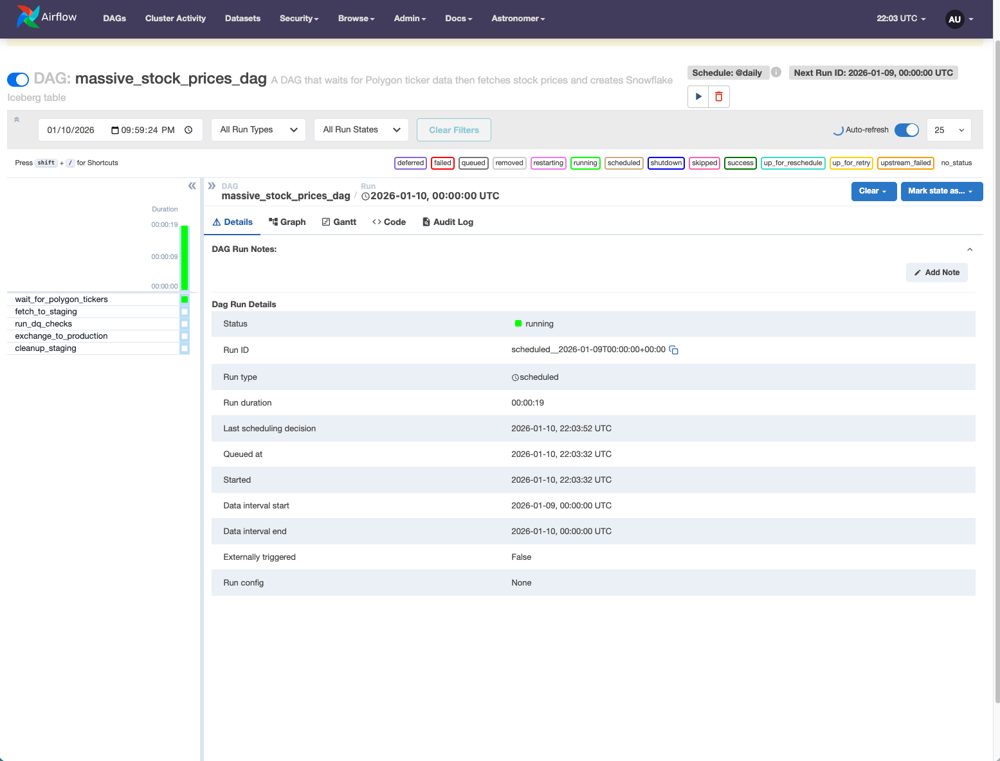

# 🔄 Airflow DQ Pipeline

> Production-grade data pipeline using **Write-Audit-Publish** pattern — the same approach used at Netflix, Airbnb, and Spotify.



## 🎯 The Problem

Most pipelines write directly to production. If bad data slips through, stakeholders see it before you can fix it.

## ✅ The Solution

**Never write to production directly.** Instead:
```
Sensor → Staging → DQ Checks → Production → Cleanup
```

## 📊 Pipeline Architecture

| Task | What It Does | Why It Matters |
|------|--------------|----------------|
| `wait_for_polygon_tickers` | Waits for upstream data | Don't run on empty tables |
| `fetch_to_staging` | Loads to staging table | Isolate unvalidated data |
| `run_dq_checks` | 4 quality validations | Catch issues early |
| `exchange_to_production` | Atomic partition swap | Zero-downtime publish |
| `cleanup_staging` | Drops temp table | No orphan data |

## 🛡️ Data Quality Checks
```python
✓ Row count > 0           # Table not empty
✓ No NULL close prices    # Required field present  
✓ All prices > 0          # Business logic validation
✓ All volumes >= 0        # No negative volumes
```

**If ANY check fails → pipeline stops → bad data never reaches production.**

## 🔧 Tech Stack

- **Orchestration:** Apache Airflow
- **Data Lake:** PyIceberg + AWS Glue Catalog
- **Storage:** S3 (Iceberg format)
- **Pattern:** Write-Audit-Publish (idempotent, backfillable)

## 🧠 Key Concepts Demonstrated

- ✅ Idempotency (same input = same output)
- ✅ Partition-scoped overwrites (preserve history)
- ✅ Sensor-based dependencies
- ✅ Staging table isolation
- ✅ Automated data quality gates

## 📚 Credit

Pattern learned from [Zach Wilson](https://linkedin.com/in/eczachly) — ex-Netflix, ex-Airbnb Data Engineer — via [DataExpert.io](https://dataexpert.io) bootcamp.

## 🔗 Related Projects

- [airflow-soda-integration](https://github.com/lubobali/airflow-soda-integration) - Soda CLI + Airflow for DQ checks
- [LuBot.ai](https://lubot.ai) - AI analytics platform with 17 nightly DQ workers

---

⭐ If this helped you, star the repo!
